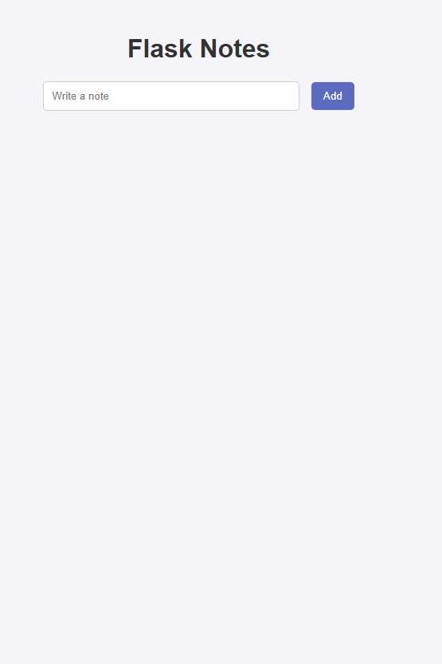
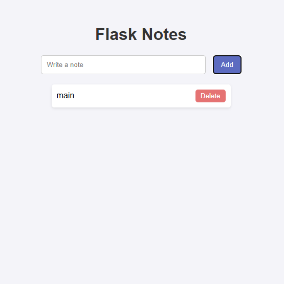

# 📝 Flask Notes Fun App

Tired of sticky notes everywhere? 🤯 Meet your new digital notebook! This simple Flask web app lets you add, delete, and view your notes — all stored safely in a JSON file. 💻✨

---

## 🚀 Feature

* Add & delete notes like a boss 📝💪
* View all your notes in one place 👀
* Notes stored in `notes.json` for persistence 💾
* Simple, lightweight, and easy to use ⚡
* Perfect for students, coders, or anyone who loves organization 🎓💡

---

## ⚡ Preview




---

## ⚙️ How to Run

1. Clone this repo:

```bash
git clone https://github.com/yourusername/flask-notes-app.git
cd flask-notes-app
```

2. Install Flask:

```bash
pip install Flask
```

3. Run the app:

```bash
python app.py
```

4. Open your browser and go to:

```
http://127.0.0.1:5000
```

Add your notes, delete the ones you don’t need, and stay organized! 🎯

---

## 🛠 Built With

* Python 🐍
* Flask ⚡
* HTML, CSS & JS 🌐

---

## 💡 Future Fun Ideas

* Add user authentication 🔒
* Sort notes by date or importance 📅⭐
* Add search functionality 🔍
* Make it super colorful and responsive 🌈🎨

---

## 📄 License

No License — do whatever you want with it 😎
